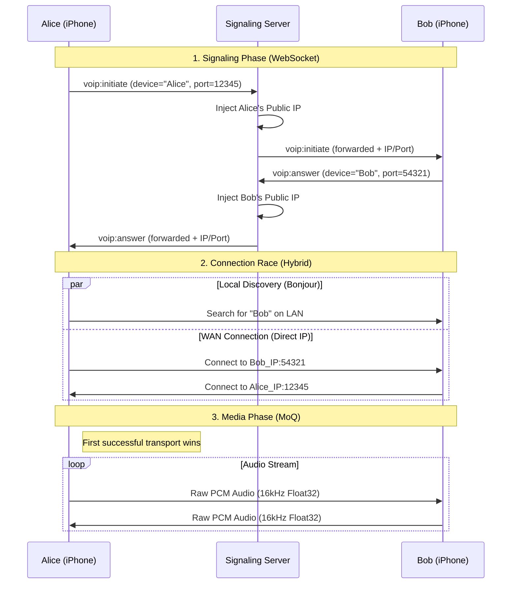

# VeriCall P2P Architecture - Media over QUIC (MoQ)

This document outlines the high-level architecture for VeriCall's P2P audio streaming and verification system.

## 🏗️ Architecture Overview

VeriCall uses a **Hybrid P2P** approach:
1.  **Signaling**: Managed via a lightweight WebSocket backend (Fly.io).
2.  **Media Transport**: Direct P2P audio streaming using **QUIC (Network.framework)**.
3.  **Discovery**:
    - **Global**: via WebSocket (Phone Number / User ID lookup).
    - **Local**: via Bonjour/mDNS (`_vericall._udp`) for low-latency P2P.

## 🔧 Components

### 1. Signaling (Backend)
- **Technology**: FastAPI + WebSockets
- **Role**:
    - User Authentication (JWT)
    - Phone Number Lookup
    - **[New]** Injecting Public IPs for WAN P2P
    - Exchanging `callId`, `deviceName`, and `listenerPort`
- **Files**: `backend/app/websocket.py`

### 2. Transport (iOS)
- **Technology**: Apple `Network.framework` (QUIC)
- **Protocol**: Custom P2P protocol over QUIC streams
- **Discovery**: 
    - **Local**: Bonjour (`_vericall._udp`)
    - **WAN**: Direct UDP/QUIC to IP:Port
- **Service**: `MoQTransportService.swift`
    - Advertises local presence and port.
    - Connects to peers via Bonjour OR Direct IP.

### 3. Audio (iOS)
- **Technology**: `AVAudioEngine`
- **Format**: 16kHz, Mono, Float32 PCM (High Fidelity)
- **Service**: `AudioStreamService.swift`
    - Captures microphone input.
    - Sends raw audio via `MoQTransportService`.
    - Receives audio and buffers it for playback and verification.

### 4. Verification (iOS)
- **Technology**: Core ML / On-device Inference
- **Service**: `DeepfakeDetectionService.swift`
    - Analyzes the `remoteBuffer` from `AudioStreamService`.
    - Determines if the voice is authentic or AI-generated.

## 🚀 Key Features

- **"YouTube Quality" Audio**: High-bandwidth local P2P allows raw uncompressed audio, improving AI analysis accuracy.
- **Zero-Latency**: Direct local connections minimize delay compared to cloud relays.
- **Privacy**: Audio data never touches the backend server.
- **Resilience**: Signaling can reconnect while P2P media continues (future enhancement).

## ⚠️ Current Limitations
- **Local Network Only**: Currently relies on Bonjour, so peers must be on the same WiFi / LAN.
- **No NAT Traversal**: For remote P2P, a TURN server or QUIC Relay would be needed (deferred for "Zero Backend" demo focus).