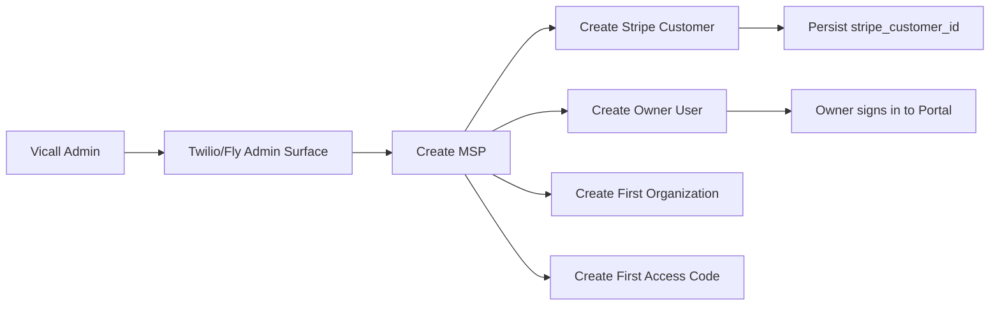
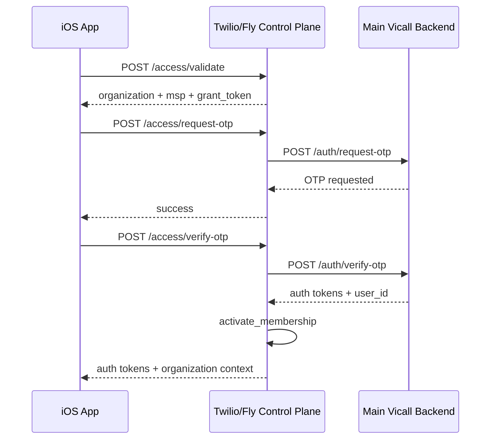
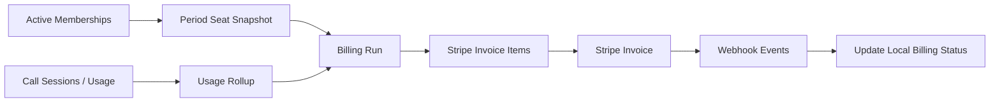

# Vicall MSP System Architecture

Last updated: April 25, 2026

## Purpose

This document describes the intended end-state architecture for the MSP product and the current production shape that already exists in the repo.

The main point is to keep one clean answer to three questions:

1. which system owns which truth
2. how an employee becomes a billable seat
3. how Stripe billing maps back to local records

## Components

### iOS App

Primary responsibilities:

- accept company access code or invite link
- validate code
- request OTP
- verify OTP
- store active company context after successful onboarding
- continue using normal Vicall features after auth

Current touchpoints:

- [Constants.swift](</Users/reeceway/Desktop/vericall voiceprints/vericall/ios/VeriCall/App/Constants.swift>)
- [AuthService.swift](</Users/reeceway/Desktop/vericall voiceprints/vericall/ios/VeriCall/Services/AuthService.swift>)
- [APIService.swift](</Users/reeceway/Desktop/vericall voiceprints/vericall/ios/VeriCall/Services/APIService.swift>)
- [OnboardingContainerView.swift](</Users/reeceway/Desktop/vericall voiceprints/vericall/ios/VeriCall/Views/Onboarding/OnboardingContainerView.swift>)

### Main Vicall Backend

Primary responsibilities:

- OTP identity flow
- refresh tokens
- user profile
- contacts
- device-auth basics

This remains the identity authority.

### Twilio/Fly Control Plane

Primary responsibilities:

- MSPs
- organizations
- access codes
- access grants
- memberships
- usage rollups
- billing runs
- MSP portal
- Stripe integration and webhook handling

This remains the membership and billing authority.

Current touchpoints:

- [app.py](</Users/reeceway/Desktop/vericall voiceprints/vericall/twilio_voice_service/app.py>)
- [control_plane.py](</Users/reeceway/Desktop/vericall voiceprints/vericall/twilio_voice_service/control_plane.py>)

### Stripe

Primary responsibilities:

- payment method storage
- customer billing portal
- invoice creation and payment state

Stripe is the external ledger, but local billing state still needs to exist for support and reporting.

## Source of Truth Matrix

| Domain | Source of truth | Notes |
| --- | --- | --- |
| user identity | Main Vicall backend | OTP and refresh flow remain here |
| MSP | Twilio/Fly control plane | Includes lifecycle state and billing linkage |
| company / organization | Twilio/Fly control plane | Child of MSP |
| access code | Twilio/Fly control plane | One code belongs to one organization |
| pending grant | Twilio/Fly control plane | Short-lived bridge between code validation and OTP verify |
| active membership | Twilio/Fly control plane | Created or refreshed after successful OTP verify |
| billable seat snapshot | Twilio/Fly control plane | Derived from membership and period rules |
| Stripe customer id | Twilio/Fly control plane + Stripe | Local copy required |
| invoice payment state | Stripe + Twilio/Fly control plane | Stripe originates, local copy reconciles |
| portal session | Twilio/Fly control plane | Must not depend on shared key bypass |

## Canonical Flows

### 1. Vicall Provisions an MSP

### 2. Employee Self-Onboarding

### 3. Monthly Billing

## Key Runtime Decisions

### Access Grants

Access grants exist so the app can validate company code before OTP verify and still carry company context into the identity flow without moving the core auth service into the control plane.

### Membership Creation Timing

Membership becomes active only after successful OTP verify. A valid access code alone is not a seat.

### Stripe Model

The current intended model is one Stripe customer per MSP and one invoice per MSP per billing cycle, with company-level line items.

## Required Production Secrets

### Twilio/Fly Control Plane

- `VICALL_ADMIN_API_KEY`
- `STRIPE_SECRET_KEY`
- `STRIPE_WEBHOOK_SECRET`
- `VICALL_CONTROL_DB_PATH`
- canonical public base URL for auth link generation

### Main Vicall Backend

- OTP provider secrets
- token signing secrets
- any user/profile database credentials already required by the app

## Architecture Risks to Eliminate

- portal-key auth bypass
- inconsistent phone normalization across app and backend
- company offboarding that is not scoped to organization
- seat-state definitions that differ between portal and billing
- webhook status drift between Stripe and local records

## Definition of Architectural Completion

The architecture is stable when:

- identity ownership is clear
- membership ownership is clear
- billing ownership is clear
- no user-facing flow crosses system boundaries ambiguously
- every invoice can be explained from local records and Stripe state together
